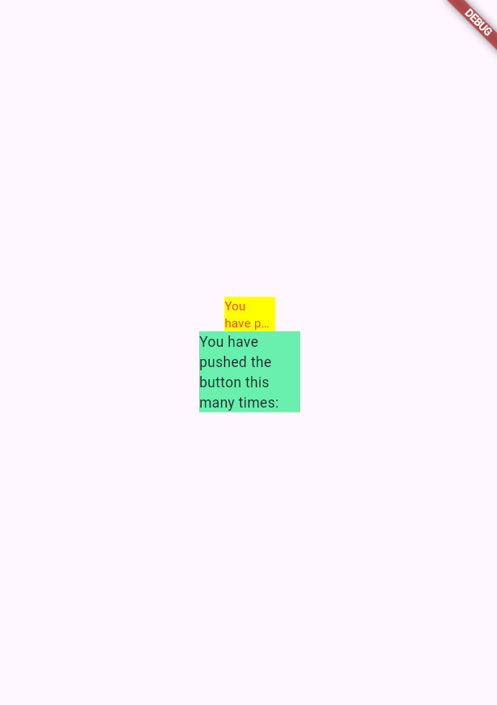

Nama : Armand Maulana Andika Putra

Kelas : TI-3C

NIM : 2241720090

# Tugas Praktikum
1. Output

2. Jelaskan maksud dari langkah 2 pada praktikum tersebut!

“flutter pub add auto_size_text” digunakan untuk menginstal plugin auto_size_text pada project

3. Jelaskan maksud dari langkah 5 pada praktikum tersebut!
- “final String text;” digunakan untuk mendeklarasikan sebuah variabel bernama text yang bertipe String.
- “const RedTextWidget({Key? key, required this.text}) : super(key: key);” merupakan sebuah konstruktor untuk kelas RedTextWid

4. Pada langkah 6 terdapat dua widget yang ditambahkan, jelaskan fungsi dan perbedaannya!
- Kode ini membuat dua Container yang masing-masing memiliki warna latar belakang berbeda dan lebar yang berbeda.
- Container pertama menampilkan teks menggunakan widget kustom RedTextWidget, yang memberikan warna merah pada teks.
- Container kedua menampilkan teks yang sama tetapi menggunakan widget Text bawaan Flutter dengan default style dan tanpa perubahan khusus pada warna teks.

5. Jelaskan maksud dari tiap parameter yang ada di dalam plugin auto_size_text berdasarkan tautan pada dokumentasi ini !
- text: variabel yang menyimpan string yang akan ditampilkan. 
- TextStyle: properti untuk mendefinisikan gaya teks.
- maxLines: 2 membatasi teks untuk ditampilkan maksimal dalam 2 baris.
- overflow: TextOverflow.ellipsis menentukan bagaimana teks akan dipotong jika melebihi batas maksimal jumlah baris
